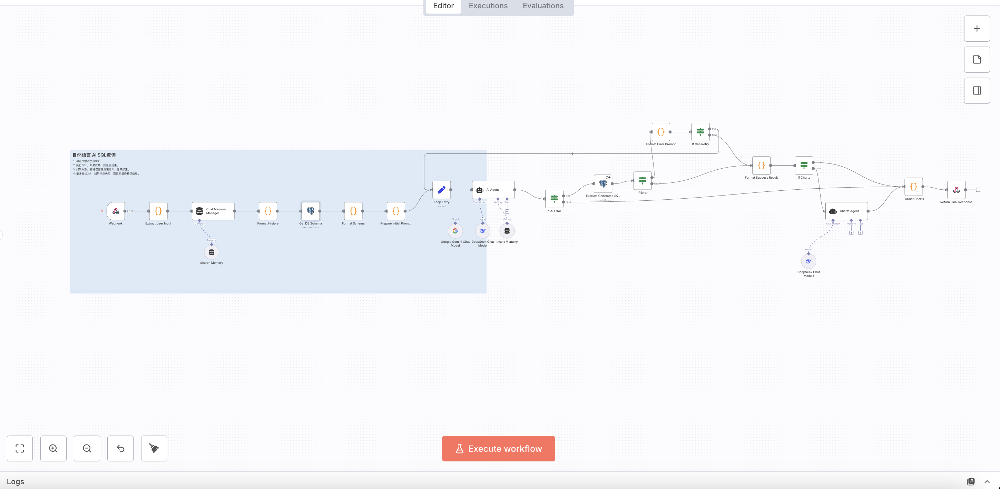
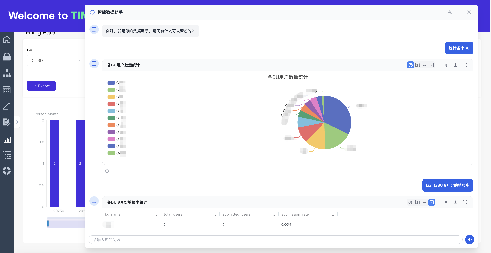
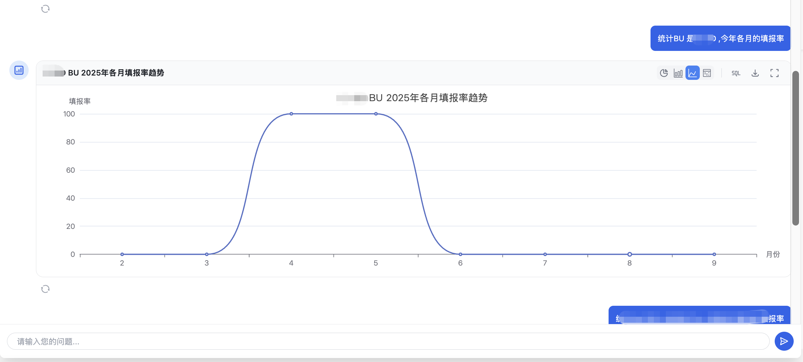
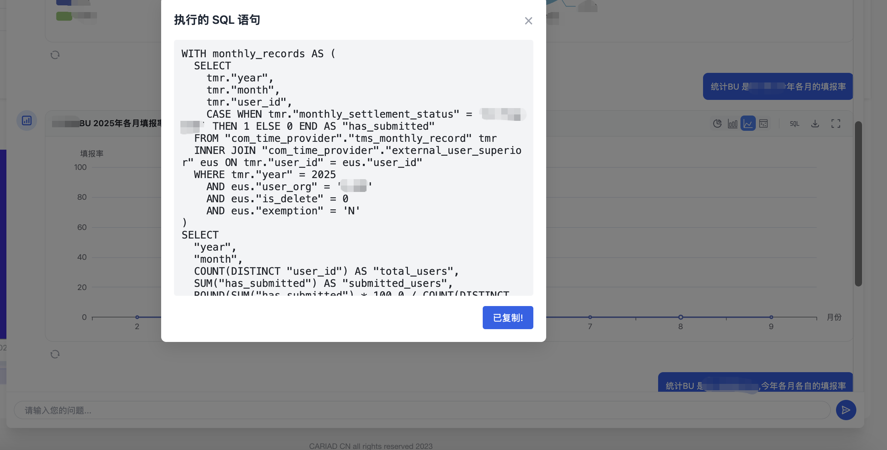
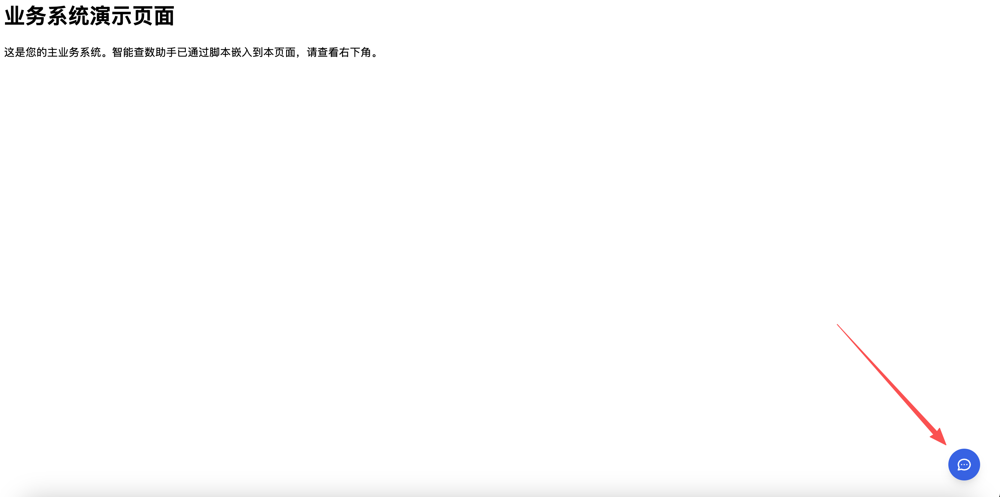
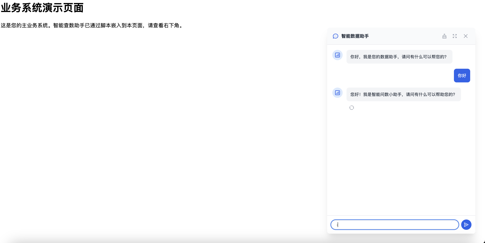

# n8n NL2SQL 智能数据查询工作流

这是一个 n8n nl2sql 的工作流，将自然语言问题转化为可执行的 SQL 查询。以一个智能数据助手嵌入 web 系统中，能查询数据库，并为数据提供可视化图表。

## 工作流


_（工作流截图）_

## UI 展示

### 在我本地嵌入业务系统的示例


_（效果 1）_


_（效果 2）_


_（效果 3）_

## ✨ 核心功能

- **自然语言转 SQL (NL2SQL):** 用日常语言提问，工作流会自动生成相应的 SQL 查询。
- **错误自修正与重试机制:** 如果生成的 SQL 执行失败，工作流会将错误信息反馈给 AI，让其自动修复查询，最多重试 3 次。
- **对话记忆能力:** 工作流通过 `sessionId` 记住对话上下文，允许用户提出追问或进行多轮对话。
- **智能图表生成:** 对于适合可视化的查询结果，工作流会自动生成图表所需的 JSON 配置（支持表格、柱状图、条形图、折线图、饼图），极大地方便了前端应用的集成。
- **支持多种大语言模型 (LLM):** 您可以轻松地切换使用不同的大语言模型，只需替换工作流中的 LLM 节点即可（例如 DeepSeek, Google Gemini, OpenAI 等）。
- **开箱即用的 API 端点:** 整个工作流通过一个 Webhook 节点暴露为 API 服务，可以轻松地与您的任何应用程序集成。

## ⚙️ 工作原理

该工作流遵循一个精密的多步骤处理流程：

1.  **接收请求:** `Webhook` 节点接收用户通过 POST 请求发送的问题（`question`）和可选的会话 ID（`sessionId`）。
2.  **获取上下文:** 工作流根据 `sessionId` 检索历史对话记录，并动态查询数据库以获取最新的表结构信息。
3.  **生成 SQL (循环与重试):**
    - **AI Agent (SQL 生成):** 将用户问题、对话历史和数据库表结构等信息整合后，发送给大语言模型，生成一个包含 SQL 语句、推荐图表类型和所用表名的 JSON 对象。
    - **执行 SQL:** 工作流尝试在您的数据库上执行生成的 SQL。
    - **处理结果:**
      - **如果成功**，数据进入下一步处理。
      - **如果失败**，错误信息会被捕获，并与原始问题一起再次发送给 AI Agent，要求其根据错误进行修正。这个自修正循环最多执行 3 次。
4.  **生成图表配置:** 如果第一次 AI 调用建议使用图表进行可视化，工作流会启动第二个 **Charts Agent**，它会根据成功的 SQL 查询结果和用户问题，生成详细的前端图表渲染所需的 JSON 配置。
5.  **格式化并返回:** 工作流将最终结果（包括查询数据、SQL 语句、图表配置等）整合成一个标准的 JSON 格式，通过 Webhook 返回给调用方。

## 🚀 快速开始

请按照以下步骤在您自己的 n8n 环境中设置并运行此工作流。

### 1. 准备工作

- 一个正在运行的 **n8n 实例** (推荐使用云版本或 Docker 自托管)。
- 一个 **PostgreSQL 数据库** 的连接凭证。
- 一个 **大语言模型 (LLM) 的 API 密钥** (例如 DeepSeek, Google Gemini, or OpenAI)。

### 2. 导入工作流

1.  下载本项目中的 `nl2sql.json` 文件。
2.  在您的 n8n 画布中，点击 "Import" -> "From File"。
3.  选择刚刚下载的 `nl2sql.json` 文件并导入。

### 3. 配置凭证

您需要为工作流中的两个关键节点设置凭证：

- **数据库节点:**

  1.  找到名为 `Get DB Schema` 和 `Execute Generated SQL` 的两个 PostgreSQL 节点。
  2.  点击每个节点，在 "Credential" 字段中，选择或创建一个新的 PostgreSQL 凭证，填入您的数据库主机、端口、用户名、密码和数据库名。

- **大语言模型 (LLM) 节点:**
  1.  找到名为 `DeepSeek Chat Model`（或您想使用的其他模型）的节点。
  2.  点击该节点，在 "Credential" 字段中，选择或创建一个新的凭证，并填入您的 LLM API 密钥。
  3.  您可以替换此节点为您偏好的任何其他 n8n 支持的 LLM 节点。

### 4. 自定义数据库结构查询

这是最关键的一步，您需要告诉工作流要分析哪些表。

1.  找到名为 **`Get DB Schema`** 的节点。
2.  点击该节点，查看其 `Query` 参数。
3.  修改 SQL 查询中的 `WHERE` 子句，以匹配您的 `schema` 和您希望 AI 感知的 `table_name`。

    ```sql
    -- 找到这一行
    WHERE
        c.table_schema = 'com_time_provider' -- <-- 修改为您自己的 schema 名称
        and c.table_name in ('extern_user','external_user_superior', ... ) -- <-- 修改为您希望 AI 使用的表名列表
    ```

## agent.html 使用说明

提供一个测试入口,也可以自己定制,根据自己需要是否使用

### 使用方式

浏览器直接打开`agent.html`,你会看到下面的页面


_（测试界面截图）_

### 配置你的 n8n 服务

在 html 文件中配置你的 n8n 地址.

```
webhookUrl: 'http://localhost:5678/webhook-test/57c8f04e-beee-4510-ba9b-cab0d331563d',
```

### 测试效果


_（测试效果截图）_

## 如何集成到自己的 web 系统

只保留`agent.html` 中的 `script` 内的代码,保存为 `agent.js`文件,
将该文件托管到系统可以访问的位置.

然后在你的系统中集成:

```
  <script>
    // 在这里定义你的配置
    window.NL2SQL_AGENT_CONFIG = {
      // 传入你的 n8n Webhook 地址
      webhookUrl: 'http://localhost:5678/webhook/57c8f04e-beee-4510-ba9b-cab0d331563d',

      // 你还可以覆盖其他任何默认设置
      position: {
        right: '40px',
        bottom: '40px'
      },
      zIndex: {
        chat: 1000 // 如果需要，可以调整层级
      }
    };
  </script>
  <script src="http://localhost:8000/agent.js" defer></script>
```

## 🔧 自定义与扩展

- **切换数据库:** 将 `PostgreSQL` 节点替换为您使用的数据库节点（如 MySQL, MSSQL 等）。同时，您需要微调 `AI Agent` 系统提示中关于 SQL 语法（特别是表名和字段名引号）的规则。
- **更换 LLM:** 只需替换 `AI Agent` 和 `Charts Agent` 连接的 LLM 节点即可。
- **优化提示 (Prompt):** 您可以编辑 `AI Agent` 和 `Charts Agent` 节点中的系统提示，以更好地适应您的业务术语或特定的查询风格。

## 如何优化效果

- 根据你的业务,优化 prompt.
- 完善你的表的 comment,字段的 comment.
- 更换更强大的模型,我在使用时 `gemini` 的效果好过 `deepseek` ,因为业务原因只能选择 `deepseek`
- 第一次接触 n8n,流程中很多细节还可以优化,可以根据自己的需要去修改,我只是提供一个思路

## 感谢

工作流的 prompt 格式参考了 [SQLBot](https://github.com/dataease/SQLBot)

## 🤝 贡献

欢迎提交 Issue 或 Pull Request 来改进这个工作流！
